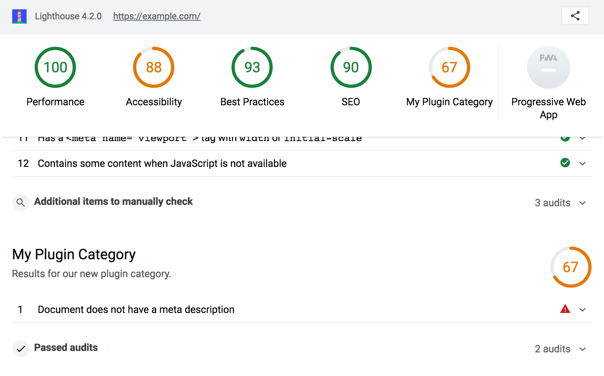

# Lighthouse plugin recipe

## Contents
- `lighthouse-plugin-preload-as` - the plugin module
  - `package.json` - declares the plugin's entry point (`plugin.js`)
  - `plugin.js` - instructs Lighthouse to run `preload-as-audit.js` and to add a new category to the report
  - `preload-as-audit.js` - the new audit to run in addition to Lighthouse's default audits
 
## To run

- `npm install`
- `npx lighthouse https://example.com --plugins=lighthouse-plugin-preload-as --view`

The input to `--plugins` will be loaded from `node_modules/` (if installed as a typical module) or from the current working directory (as in this example).

## Result

